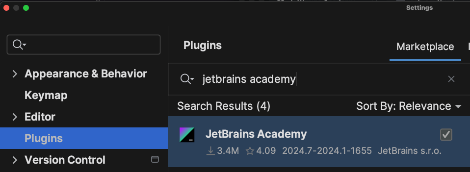
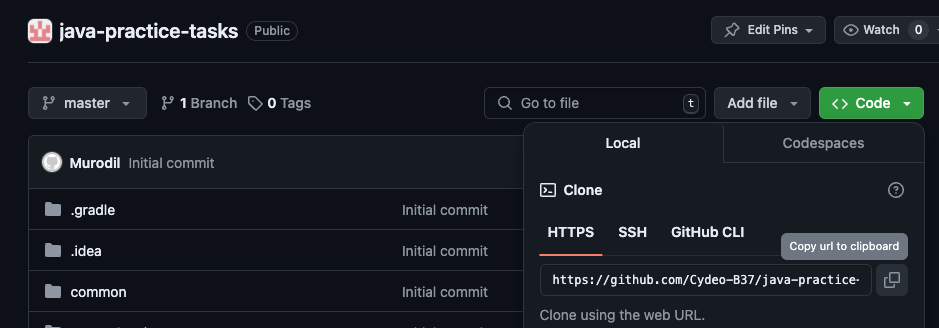
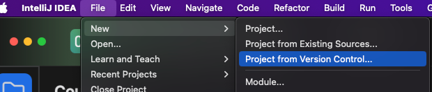
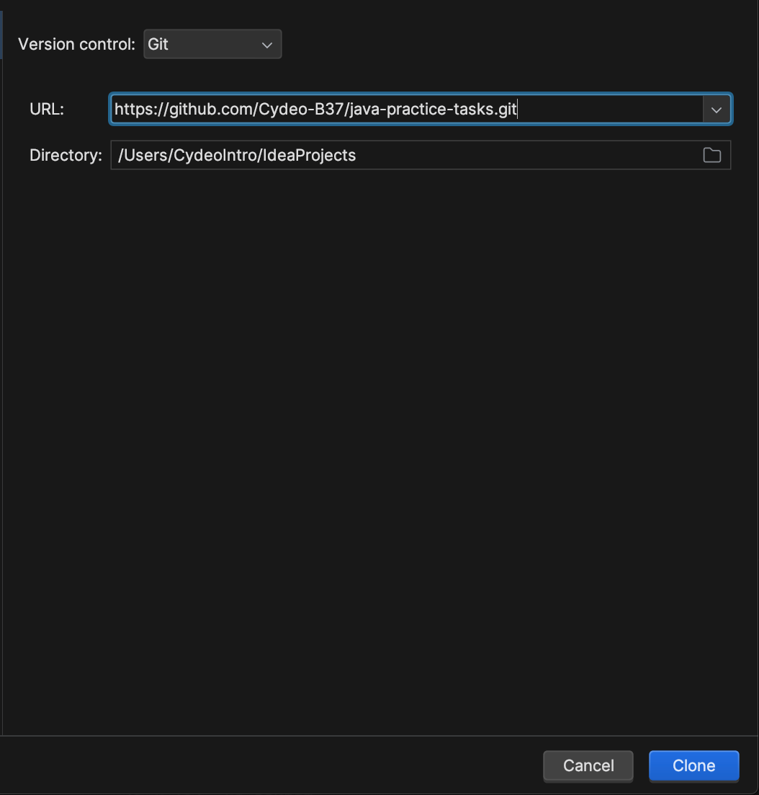
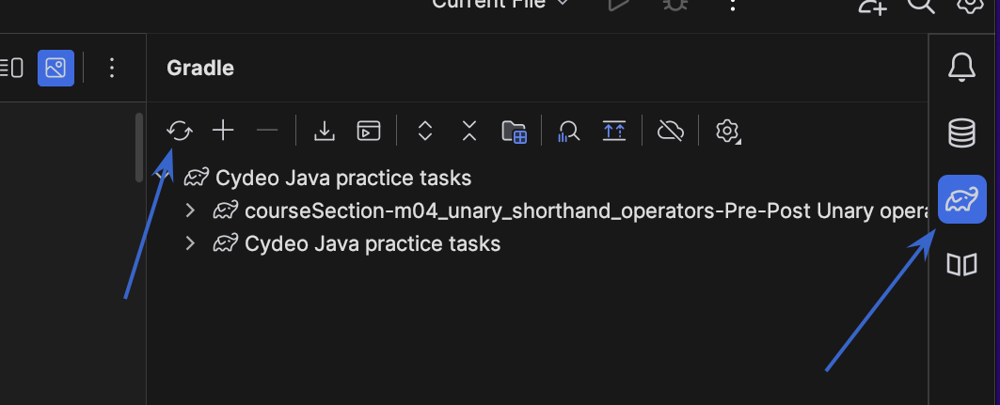
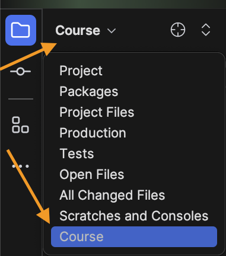
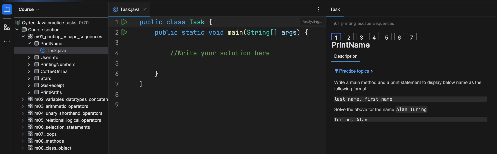

# Java Practice tasks project

## 
this project is used to practice java tasks based on Cydeo SDET Java program

- [Plugin Installation](#plugin_installation)
- [Cloning the project](#Cloning_the_project)
- [Solving the tasks](#solving_the_tasks)

## Plugin_Installation

1. **IntelliJ Jetbrains Academy plugin**

- In IntelliJ, goto Settings > Plugins and search for `Jetbrains Academy` under Marketplace. Then click on **install**

- it might ask you to restart IntelliJ, please do so.

## Cloning_the_project

1. Copy this repository url: Code > Copy icon

2. In IntelliJ, goto File > New > Project from version control...
3. If IntelliJ asks you to install Git, please do so by clicking that link.
4. Paste the url and click on Clone

## Gradle setup if tasks are not displayed.

1) Click on Open Gradle Settings next to Error message:

2) Goto IntelliJ setting > Build,Execution > Gradle > Set Gradle JVM as JDK17 > Apply > Ok

3) Perform Gradle update:

3) Make sure Course is selected under project name:

## Solving_the_Tasks

1) Select the task in course section
2) Read the requirements on the left
3) Type your solution in Task.java file
4) Run the main method to check your solution
5) Click on Check button to run instructor tests

